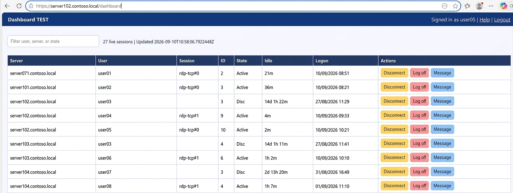

# RDS Dashboard Lite

A lightweight Windows RDS session dashboard hosted at https://github.com/nicozanf/RDS_dashboard_lite.
It's built with native PowerShell/.NET components and standard Windows commands such as `quser`. It keeps only the latest live snapshot in the server process memory. It does not need a Web server, nor a database (not even SQLite).

It's a stripped down version of the RDS dashboard hosted at https://github.com/nicozanf/RDS_dashboard. Removing data saving for history graphs greatly reduces its cpu/memory footprint.

the **main lite Dashboard**. All the current sessions are listed and searchable. You can disconnect / logoff /message users.

## Features

- HTTPS on port 443
- AD form-based authentication
- Automatic operation through a Windows Service
- Live searchable session dashboard
- Session actions: disconnect, logoff, and send message
- Configurable collection load through `MaxConcurrentJobs` and `CollectCpuRam`
- Help page

For prerequisites and deployment, see [INSTALL.md](docs/INSTALL.md).

For configuration details, see [CONFIG.md](docs/CONFIG.md).

For retained API endpoints and security behavior, see [API.md](docs/API.md).

For AI agent guidance, see [AGENTS.md](docs/AGENTS.md).

## Folder Contents

- `docs/`: documentation
- `webapp/server.ps1`: HTTPS server, AD authentication, dashboard, and session actions
- `webapp/collector.ps1`: live RDS session collector
- `webapp/common.psm1`: configuration and console diagnostics
- `webapp/job-pool.psm1`: reusable collection runspace pool
- `webapp/setup_https_443.ps1`: certificate, SSL binding, and URL ACL setup
- `webapp/install_service.ps1`: Windows Service installation
- `webapp/run_webapp.cmd`: foreground launcher
- `webapp/config-example.toml`: configuration template
- `webapp/templates/`: login, dashboard, and help pages
- `webapp/runtime/`: runtime directory reserved for deployment compatibility; live data is held in memory

## License

This project is licensed under the [MIT License](LICENSE).
